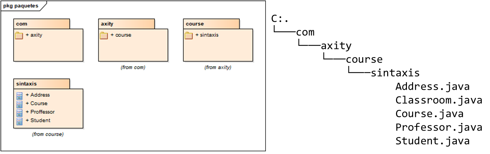
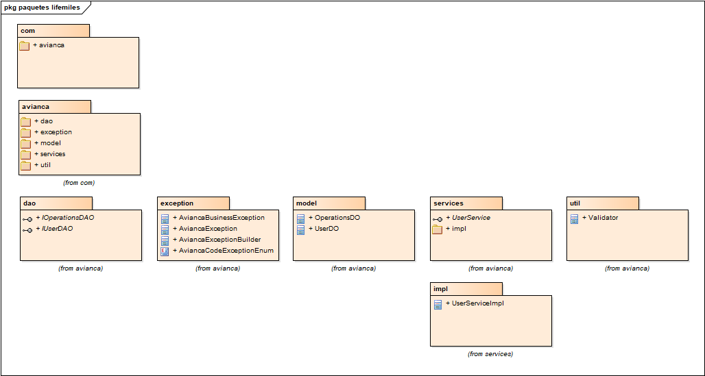
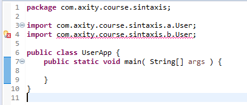

# Paquetes

De acuerdo a Oracle:

> A package is a namespace that organizes a set of related classes and interfaces. 
> Conceptually you can think of packages as being similar to different folders on your computer. 

La función primaria de un paquete en Java es agrupar clases relacionadas, de manera similar a la estructura de directorios del sistema de archivos. 
<br>Los paquetes normalmente se emplean para:
* Evitar conflictos de nombrado.
* Escribir código mantenible.

Existen los paquetes:
* Paquetes internos ( Java API ).
* Paquetes definidos por el desarrollador.

Un paquete consiste en los subpaquetes y las clases que lo componen, para emplear un paquete o una clase de las librerías se requiere emplear la *keyword* <b>import</b> :

Sintaxis:
```java
// Nombre del paquete de la clase
package [(<paquete0>.<paquete1>...<paqueteN>.]

// Importa una clase
import [(<paquete0>.<paquete1>...<paqueteN>.]Class;
// Importa todas las clases del paquete
import [(<paquete0>.<paquete1>...<paqueteN>.]*;
```

Por ejemplo:


Es posible importar todas las clases del paquete sintaxis:
```java
import com.axity.course.sintaxis.*
```

* <b>Nota:</b> Esto se considera una mala práctica por el uso de memoria. 
> Blindly importing all the classes in a package clutters the class namespace and could lead to conflicts between classes in different packages with the same name. On the other hand, specifically listing the necessary classes avoids that problem and makes clear which versions were wanted. 
<br>[Wildcard imports should not be used][2]


O bien sólo importar una o más clases.
```java
import com.axity.course.sintaxis.Address;
import com.axity.course.sintaxis.Student;
```
* <b>Nota:</b>Sólo es necesario importar las clases que son de distintos paquetes, es decir las clases del mismo paquete son visibles en el espacio de dominio del paquete.


Es práctica común separar los paquetes por tipo, dominio o capa, por ejemplo:

```java 
package com.avianca.services.impl;

import java.util.List;

import javax.inject.Inject;

import com.avianca.dao.IUserDAO;
import com.avianca.dao.IOperationsDAO;
import com.avianca.exception.AviancaBusinessException;
import com.avianca.exception.AviancaCodeExceptionEnum;
import com.avianca.exception.AviancaException;
import com.avianca.exception.AviancaExceptionBuilder;
import com.avianca.model.OperationsDO;
import com.avianca.model.UserDO;
import com.avianca.services.UserService;
import com.avianca.util.Validator;

public class UserServiceImpl implements UserService {
    // ...
}
```

En este caso existen las capas:
* DAO --> com.avianca.dao
* Excepciones --> com.avianca.exception
* Modelo --> com.avianca.model
* Servicios --> com.avianca.services
* Servicios [implementación] --> com.avianca.services.impl
* Utilerías --> com.avianca.util




## Convenciones de nombrado de paquetes

* Sólo emplear catacteres ASCII y en su defecto el guión "_".
* El nombre de cominio será el DN de la empresa (cliente), i.e. com.axity, seguido por el nombre del proyecto/módulo.
* Los subpaquetes deberán nombrarse por nombres de capa, negocio en minúsculas.
* De preferencia se empleará el idioma inglés, salvo que se indique lo contrario.


Ejemplos de paquetes válidos por capa:
* com.axity.course.sintaxis.dao
* com.axity.course.sintaxis.model
* com.axity.course.sintaxis.service

Ejemplos de paquetes válidos por negocio y capa:
* com.axity.course.project.trainee.dao
* com.axity.course.project.trainee.model
* com.axity.course.project.trainee.service
* com.axity.course.project.user.dao
* com.axity.course.project.user.model
* com.axity.course.project.user.service
* com.axity.course.project.util

Ejemplos de paquetes válidos por capa y tecnología:
* com.axity.course.project.persistence.oracle.dao
* com.axity.course.project.persistence.oracle.entities
* com.axity.course.project.persistence.mssqlserver.dao
* com.axity.course.project.persistence.mssqlserver.entities

<br><br>

## Colisión de nombres

En el caso de que existan dos clases con el mismo nombre (mismo case), se debe seleccionar la clase "default" como parte del import o de lo contrario el compilador dará un error:




|Description|Resource|Path|Location|Type|
|-----------|--------|----|--------|----|
|The import com.axity.course.sintaxis.b.User collides with another import statement|	UserApp.java	| /sintaxis/src/main/java/com/axity/course/sintaxis	|line 4	|Java Problem|

<br><br>Para solucionarlo se deberá emplear el nombre calificado (*qualified name*), <paquete>.<clase>

```java
package com.axity.course.sintaxis;

import com.axity.course.sintaxis.a.User;

public class UserApp {
	public static void main(String[] args) {

		User usuario = new User();
		usuario.name = "gsegura";

		com.axity.course.sintaxis.b.User otroUsuario = new com.axity.course.sintaxis.b.User();
		otroUsuario.username = "guillermo.segura";

	}
}
```

* <b>Nota:</b> En la medida de lo posible se debe evitar esto ya que permite confusiones.
<br>Estrategias, agregar un posfijo a la clase, i.e.
    * UserTO  [Transfer object]
    * UserDO  [Data object]
    * UserController [Controller]
    * UserDAO [Data Access Object]
    * UserService [Service]

<br><br>

## Static import

En el caso de las clases con atributos (constantes) y métodos estáticos es posible sólo importar la constante y su método.

```java 
import java.lang.Math;

public class Areas {

	private double circle(double radious) {
		return Math.PI * Math.pow(radious, 2.0);
	}

	public static void main(String[] args) {
		Areas a = new Areas();
		System.out.println(a.circle(2));
	}
}

```

Pueden importarse la constante PI y el método estátic pow

```java 
import java.lang.Math;
import static java.lang.Math.PI;

public class Areas {

	private double circle(double radious) {
		return PI * pow(radious, 2.0);
	}

	public static void main(String[] args) {
		Areas a = new Areas();
		System.out.println(a.circle(2));
	}
}


```

[Regresar][1]

[1]: ../README.md

[2]: https://rules.sonarsource.com/java/RSPEC-2208