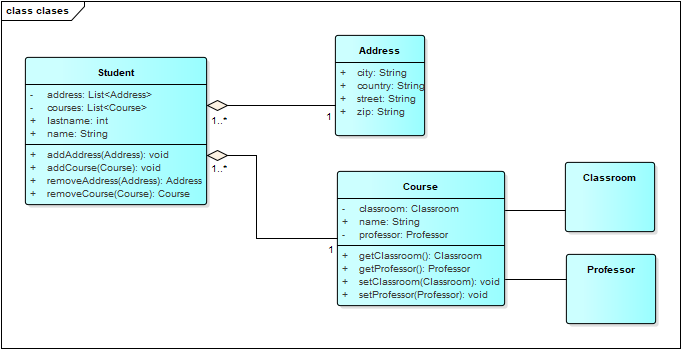
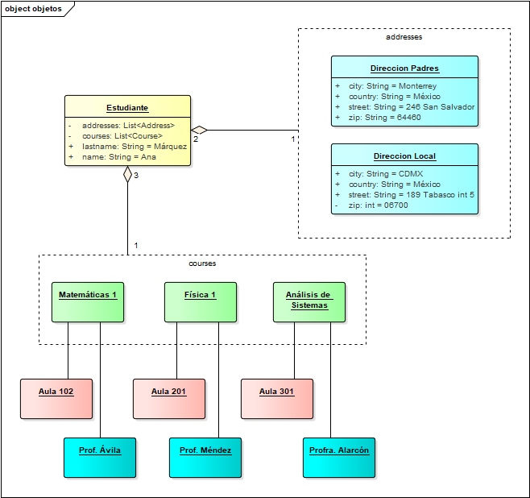

# Sintaxis

Java sigue una sintaxis similar a C/C++, por ejemplo:


```java
package com.axity.course.sintaxis;

import java.util.Date;

public class MyClase {
	private int id;
	private String name;
	private Date date;

	public MyClase() {
		this.id = 0;
		this.date = new Date();
	}

	public MyClase(int id, String name) {
		this.id = id;
		this.name = name;
		this.date = new Date();
	}

	public static void main(String args[]) {
		MyClase myClase = new MyClase();
		myClase.name = "Axity";

		System.out.println(myClase.name + " [" + myClase.date + "], id:" + myClase.id);

		myClase = new MyClase(1, "Curso Java");

		System.out.println(myClase.name + " [" + myClase.date + "], id:" + myClase.id);
	}
}

```
[Código fuente][3]

1. Se crea una estructura de paquetes (carpetas) separadas por <b>"."</b>
```
C:.
└───com
    └───axity
        └───course
            └───sintaxis
                    MyClase.java
```
```java
package com.axity.course.sintaxis;
```
2. Se importan otras clases por medio de la *keyword* <font color="#d73a49"><b>import</b></font>, se permite el uso del wildcard * en caso de querer importar todas las clases del paquete. [No es recomendable]

```java
import java.util.Date;
```

3. La *keyword* <font color="#d73a49"><b>class</b></font> indica que se trata de una clase. 
<br>Una clase, regularmente, equivale a un archivo con extensión <b>.java</b>. 
<br>Es sensible a mayúsculas y minúsculas, por convención se utilizan nombres en Upper CamelCase (PascalCase) ([Convenciones de nombrado][2]).
<br>Las clases contienen atributos y métodos.

```java
public class MyClase {
```

4. El método principal es el método <font color="#6f42c1"><b>main</b></font>, su firma es:
```java
public static void main (String args[]) {
    //...
}
```

5. Se emplean modificadores de acceso para los atributos y los métodos con las *keywords*:
   * <font color="#d73a49"><b>public</b></font>,
   * <font color="#d73a49"><b>protected</b></font>,
   * <font color="#d73a49"><b>private</b></font>,
   * O ninguno (de paquete).

6. Los atributos se les indica su tipo, puede ser un primitivo (int, double) o una clase (String, Date).

7. Para crear instancias de objetos se emplea la *keyword* <font color="#d73a49"><b>new</b></font> seguida de paréntesis (constructor).
    ```java
    MyClase myClase = new MyClase();
    ```

    <br>En caso de ser requerido se pueden pasar parámetros al constructor. 
    ```java
    myClase = new MyClase(1, "Curso Java");
    ```

8. Las líneas se terminan con <b>";"</b>

9. Los bloques se separan por medio de llaves <b>"{"</b> y <b>"}"</b>.
<br>Los espacios en Java son empleados para indentar el código para la lectura humana, el compilador los discrimina y trata por igual espacios y tabuladores.
<br>Se sugiere emplear espacios en lugar de tabuladores, 4 espacios por cada bloque.
<br>Evitar líneas mayores a 120 caracteres (80 en monitores con resoluciones menores).
<br>Se sugiere emplear codificación UTF-8.

10. En el caso de nombrado de paquetes, clases, atributos, métodos se sugiere seguir una convención, por ejemplo:
    * [Convenciones de nombrado][2].
    * Emplear idioma inglés a menos que se indique lo contrario.
    * Evitar acrónimos o siglas, a menos que sean reconocidos en la organización; i.e. rfc, html, url.
    * Evitar el Spanglish.
    * Emplear [comentarios][4] que sirvan para entender la lógica empleada, indiquen javadoc o sirvan como firma o copyright.

<br><br><br>

## Componentes del lenguaje

### Clase

<b>Plantilla</b> que describe los <b>tipos de estado (atributos) </b> y el <b>comportamiento (métodos)</b> que sirve para representar entidades o conceptos.



```java
public class Student {
	public String name;
	public String lastname;
	private List<Address> addresses;
	private List<Course> courses;

	public void addAddress(Address address) {
		// agregar direccion
	}

	public void addCourse(Course course) {
		// agregar curso
	}

	public Address removeAddress(Address address) {
		// quitar direccion y regresar su data
		return null;
	}

	public Course removeCourse(Course course) {
		// quitar curso y regresar su data
		return null;
	}
}
```

### Objeto

En tiempo de ejecución, cuando la máquina virtual Java (<b>JVM</b>) encuentra la palabra clave <b>new</b>, utilizará
la <b>clase</b> adecuada para crear un objeto que sea una <b>instancia de esa clase</b>.

Ese <b>objeto</b> tendrá su propio <b>estado</b> y acceso a todos los comportamientos definidos por su clase.



```java
Address direccionPadres = new Address();
Address direccionLocal = new Address();
Course mate1 = new Course();
Course fisica1 = new Course();
Course analisisSistemas = new Course();

Student student = new Student();
student.name = "Ana";
student.lastname = "Márquez"
student.addAddress(direccionPadres);
student.addAddress(direccionLocal);
student.addCourse(mate1);
student.addCourse(fisica1);
student.addCourse(analisisSistemas);
```

### Estado (variables de instancia / atributos)

Cada objeto (instancia de una clase) tendrá su propio conjunto único de variables de instancia como
se define en la clase. 

En conjunto, los valores asignados a las variables de instancia de un objeto
constituyen el estado del objeto.

```java
student.name = "Ana";
student.lastname = "Márquez"
```

### Comportamiento (métodos)

* Cuando un programador crea una clase, crea métodos para esa clase. 
* Los métodos son donde se almacena la lógica de la clase y donde se realiza el trabajo real. 
* Allí es donde se ejecutan los algoritmos y se manipulan los datos.


```java
	public void addAddress(Address address) {
		// Validar si está inicializada la lista de direcciones
		if (this.addresses == null) {
			this.addresses = new ArrayList<>();
		}
		// Validar si la direccion no existe
		if (!this.addresses.contains(address)) {
			// Agregar la nueva direccion
			this.addresses.add(address);
		}
	}
```


## Identificadores

Todos los componentes de Java  (clases, variables y métodos) necesitan <b>nombres</b>.

### Identificadores legales

* Los identificadores deben comenzar con una <b>letra</b>, un carácter de moneda (<b>$</b>) o un carácter de conexión como el guión bajo
(_). <br>¡Los identificadores <b>no</b> pueden comenzar con un <b>dígito</b>!


* Después del primer carácter, los identificadores pueden contener <b>cualquier</b> combinación de <b>letras</b>, caracteres de <b>moneda</b>,
caracteres de <b>conexión</b> o <b>números</b>.

* En la práctica, no hay límite para el número de caracteres que puede contener un identificador.

* No se puede utilizar una <b>palabra reservada</b> de Java (*keyword*) como identificador.

* Los identificadores en Java distinguen entre mayúsculas y minúsculas; foo y FOO son dos identificadores diferentes.


## Convenciones de nombrado

* [Code Conventions for the Java TM Programming Language][5] April 20th, 1999
* [Google Java Style Guide][6]


<b>TODOS</b> los identificadores deberán utilizar sólo letras ASCII y dígitos, en menor medida se puede utilizar los símbolos <b>"_"</b> y <b>"$"</b>.


### Clases e interfaces

* La primera letra debe estar en <b>mayúscula</b>, y si varias palabras están unidas para formar el nombre,
la primera letra de las palabras internas debe estar en mayúscula (<b>"Upper CamelCase" o "PascalCase"</b>).

* Los nombres de las <b>Clases</b> normalmente deberán ser <b>sustantivos</b>, por ejemplo:

```java
class Student { }
class Course { }
class Professor { }
class Address { }
```

* Los nombres de las interfaces normalmente deberán ser <b>adjetivos</b> o <b>sustantivos</b> en caso que representen una familia de clases (*taxonomía*), por ejemplo:

```java
interface Runnable { }
interface Serializable { }
interface Comparable { }
interface StudentDAO { }
interface StudentService { }
interface RulesInterceptor { }
```

### Métodos

* La primera letra debe estar en <b>minúsculas</b> y luego deben usarse las reglas normales de <b>CamelCase</b>. 

* Los nombres normalmente deben ser pares de <b>verbo-sustantivo</b>, por ejemplo:

```java
getName
setName
addAddress
removeAddress
```

<br><br><br>

## Lista de palabras reservadas en Java

En Java no pueden emplearse las siguientes *keywords*

|   |   |   |   |   |  |
| -------- | ------ | ------- | ----- | ---- | ---- |
| abstract | assert | boolean | break | byte | case |
| catch | char | class | const | continue | default |
| double | do | else | enum | extends | false |
| final | finally | float | for | goto | if |
| implements | import | instanceof | int | interface | long |
| native | new | null | package | private | protected |
| public | return | short | static | strictfp | super |
| switch | synchronized | this | throw | throws | transient |
| true | try | void | volatile | while | | 


[Regresar][1]

[1]: ../README.md

[2]: https://es.wikipedia.org/wiki/Convenci%C3%B3n_de_nombres_(programaci%C3%B3n)#Java

[3]: sintaxis/src/main/java/com/axity/course/sintaxis/MyClase.java

[4]: comentarios.md

[5]: https://www.oracle.com/java/technologies/javase/codeconventions-contents.html

[6]: https://google.github.io/styleguide/javaguide.html